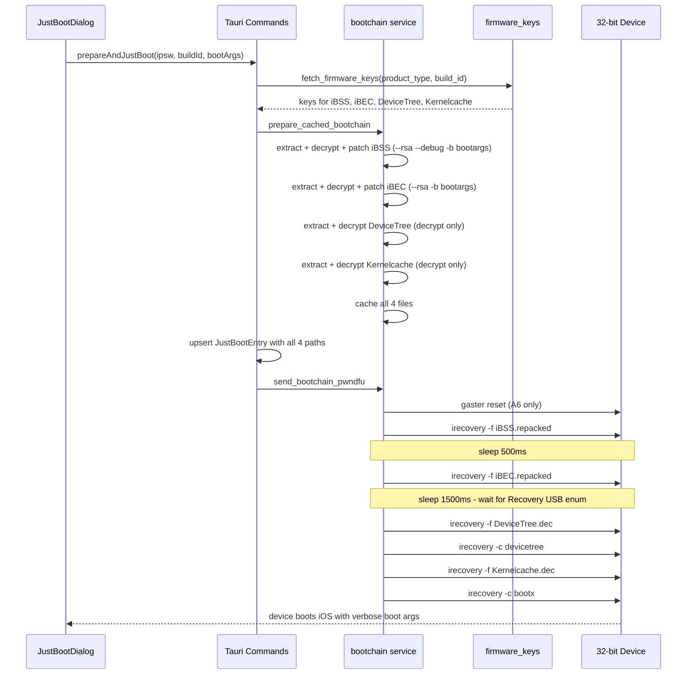

# Just Boot Refactor Plan
**Status:** Planning  
**Priority:** Critical — root cause identified, full script parity required

---

## 1. Source Script Analysis (`restore.sh`)

### `device_justboot()` — [restore.sh:11357](../restore.sh:11357)

```bash
device_justboot() {
    if [[ -z $device_bootargs ]]; then
        device_bootargs="pio-error=0 -v"          # default bootargs
    fi
    if [[ $main_argmode == "device_justboot" ]]; then
        cat "$device_rd_build" > "../saved/$device_type/justboot_${device_ecid}"   # persist history
    fi
    if [[ $device_rd_build == "14"* ]]; then
        device_enter_mode DFU
        kuroutadori_init
        kuroutadori_litera1n -T                    # iOS 14+ / A12 checkm8 tether (out of scope)
        return
    fi
    device_ramdisk justboot                        # primary path for all 32-bit devices
}
```

**Key observations:**
- Default bootargs: `"pio-error=0 -v"` (not just `"-v"`, includes `pio-error=0`)
- iOS 14+ (`14E*`, `14F*`, `14G*`) uses a completely different path (out of scope)
- Everything else goes through `device_ramdisk justboot`

---

### `device_ramdisk justboot` — [restore.sh:6830](../restore.sh:6830)

The function has a `$1 == "justboot"` mode that diverges in several critical ways from the SSH ramdisk path:

#### Component list (line 6831, 6848)
```bash
local comps=("iBSS" "iBEC" "DeviceTree" "Kernelcache")
if [[ $1 != "justboot" ]]; then
    comps+=("RestoreRamdisk")   # RestoreRamdisk is NOT downloaded for justboot
fi
```

#### IPSW path resolution (lines 6866–6876)
- If `$ipsw_justboot_path` is set, extracts directly from the IPSW zip
- Otherwise falls back to downloading individual components via `pzb`

#### `all_flash` path for DeviceTree (lines 1533, 6890–6896)
```bash
all_flash="Firmware/all_flash/all_flash.${device_model}ap.production"
# For builds 14E/F/G: path = "Firmware/all_flash/"
# For all others:     path = "$all_flash/"  (i.e., Firmware/all_flash/all_flash.n41ap.production/)
```

#### Component filenames (lines 6899–6916)
If the firmware keys API doesn't provide a filename, filenames are derived from `device_model` and `build_id`:
```bash
case $getcomp in
    "iBSS" | "iBEC" ) name="$getcomp.$hwmodel.RELEASE.dfu";;
    "DeviceTree" )    name="$getcomp.${device_model}ap.img3";;
    "Kernelcache" )   name="kernelcache.release.$hwmodel";;
esac
# hwmodel = device_model + "ap" for iOS 7-11 builds, device_model for older builds
```

#### Decryption (lines 6934–6942)
```bash
# S5L8900/iPod2,1: no -decrypt flag, just -iv -k
if [[ $getcomp == "Kernelcache" || $getcomp == "iBSS" ]] && [[ $device_proc == 1 || $device_type == "iPod2,1" ]]; then
    "$dir/xpwntool" $getcomp.orig $getcomp.dec -iv $iv -k $key
# iOS 14 builds: no decryption needed (already plaintext)
elif [[ $build_id == "14"* ]]; then
    cp $getcomp.orig $getcomp.dec
# Standard case (A4-A6, iOS 6-13):
else
    "$dir/xpwntool" $getcomp.orig $getcomp.dec -iv $iv -k $key -decrypt
fi
```

#### iBSS patching (line 6997) — DIVERGES FROM CURRENT LEGACYKIT
```bash
# Script uses --debug flag on iBSS for BOTH justboot and ramdisk modes:
"$dir/iBoot32Patcher" iBSS.raw iBSS.patched --rsa --debug -b "$device_bootargs"
```

#### iBEC patching (lines 7004–7010) — CRITICAL DIFFERENCE
```bash
if [[ $1 == "justboot" ]]; then
    # NO --debug flag for justboot iBEC:
    "$dir/iBoot32Patcher" iBEC.raw iBEC.patched --rsa -b "$device_bootargs"
else
    # Ramdisk mode uses different bootargs entirely:
    "$dir/iBoot32Patcher" iBEC.raw iBEC.patched --rsa --debug -b "rd=md0 -v amfi=0xff ..."
fi
```

#### iOS 7.x/8.x short-circuit for non-iPad devices (lines 7000–7001)
```bash
if [[ $build_id == "7"* || $build_id == "8"* ]] && [[ $device_type != "iPad"* ]]; then
    :  # skip iBEC patching entirely
fi
```

#### Mode entry (line 7029–7030)
```bash
if [[ $1 == "jailbreak" || $1 == "justboot" || $device_type == "iPod2,1" ]]; then
    device_enter_mode pwnDFU   # justboot ALWAYS uses pwnDFU
fi
```

#### A6 pwnDFU sequence — `device_send_unpacked_ibss()` [restore.sh:2345]
For A6, `device_enter_mode pwnDFU` calls `device_send_unpacked_ibss`:
1. Clears `device_rd_build=` (critical: forces ramdisk default build)
2. Calls `patch_ibss` which uses build `12H321` (iOS 8.4.1) for most A6 devices
3. Resets gaster → sends the **ramdisk build's pwnediBSS.dfu** (NOT the target IPSW's iBSS)
4. Device enters "pwned iBSS mode"

#### Sending sequence — THE ROOT CAUSE (lines 7037–7074)
```bash
# After pwnDFU (which already sent ramdisk iBSS for A6):
# For A6 (proc 6): the `elif (( device_proc < 5 ))` block is SKIPPED
# So target iBSS from IPSW is NOT sent again for A6

sleep 1

# Send target iBEC (from justboot target IPSW):
if [[ $build_id != "7"* && $build_id != "8"* ]]; then
    $irecovery -f iBEC
fi

device_find_mode Recovery       # wait for USB to re-enumerate as recovery PID 0x1281

# justboot SKIPS the ramdisk send

# Send DeviceTree and Kernelcache from target IPSW:
$irecovery -f DeviceTree.dec
$irecovery -c devicetree
$irecovery -f Kernelcache.dec
$irecovery -c bootx

if [[ $1 == "justboot" ]]; then
    log "Device should now boot."
    return
fi
```

**There is NO `setenv auto-boot true; saveenv; fsboot` anywhere in the justboot path.**

---

### `device_model` Hardware Model Table — [restore.sh:1448](../restore.sh:1448)

The script maintains a complete `product_type → device_model` mapping. Key entries for the primary justboot targets:

| product_type | device_model | all_flash prefix |
|---|---|---|
| iPhone5,1 | n41 | Firmware/all_flash/all_flash.n41ap.production/ |
| iPhone5,2 | n42 | Firmware/all_flash/all_flash.n42ap.production/ |
| iPhone5,3 | n48 | Firmware/all_flash/all_flash.n48ap.production/ |
| iPhone5,4 | n49 | Firmware/all_flash/all_flash.n49ap.production/ |
| iPhone4,1 | n94 | Firmware/all_flash/all_flash.n94ap.production/ |
| iPhone3,1 | n90 | Firmware/all_flash/all_flash.n90ap.production/ |
| iPad3,4 | p101 | Firmware/all_flash/all_flash.p101ap.production/ |
| iPod5,1 | n78 | Firmware/all_flash/all_flash.n78ap.production/ |

Full table from the script (lines 1448–1525) must be reproduced in Rust for path resolution.

---

## 2. Root Cause Analysis — Current LegacyKit vs Script

### Critical Missing Pieces

| Step | Script behavior | Current LegacyKit | Status |
|---|---|---|---|
| Default bootargs | `"pio-error=0 -v"` | `"pio-error=0 -v"` | ✓ |
| iBSS extract + decrypt | From target IPSW | From target IPSW | ✓ |
| iBSS patch flags | `--rsa --debug -b <args>` | `--rsa -b <args>` | ✗ Missing `--debug` |
| iBEC extract + decrypt | From target IPSW | From target IPSW | ✓ |
| iBEC patch flags | `--rsa -b <args>` (no `--debug`) | `--rsa -b <args>` | ✓ |
| DeviceTree extract | From target IPSW | **Not extracted** | ✗ |
| DeviceTree decrypt | `xpwntool -iv -k -decrypt` | **Not done** | ✗ |
| Kernelcache extract | From target IPSW | **Not extracted** | ✗ |
| Kernelcache decrypt | `xpwntool -iv -k -decrypt` | **Not done** | ✗ |
| pwnDFU entry | For A6: gaster+ramdisk iBSS | For A6: gaster reset only | ~ |
| Send iBEC | `irecovery -f iBEC` | `irecovery -f iBEC` | ✓ |
| Wait for Recovery | `device_find_mode Recovery` | 1500ms sleep | ~ |
| Post-iBEC commands | **`irecovery -f DeviceTree.dec`** → `-c devicetree` → `-f Kernelcache.dec` → `-c bootx` | ~~`setenv auto-boot true; saveenv; fsboot`~~ | **✗ WRONG** |
| History persistence | File per ECID with build ID | JSON store with full metadata | ✓ improved |
| Firmware keys — DeviceTree | Fetched via `device_fw_key_check` | **Not fetched** | ✗ |

### Why the Device Gets Stuck

After iBEC is loaded on a 32-bit device, iBEC sits at a USB recovery prompt waiting for the host to stage the kernel. Without `DeviceTree` → `devicetree` command → `Kernelcache` → `bootx`, the device simply stays in iBEC's recovery mode indefinitely. The `setenv auto-boot true; saveenv; fsboot` commands were an incorrect attempt to fix this — `fsboot` tells iBEC to boot from NAND flash, but iBEC on 32-bit devices can't do that without a properly staged kernel image. Hence the black screen / stuck state.

---

## 3. Refactor Plan — Ordered by Priority

### Phase 1 — Core Bootchain Fix [`src-tauri/src/services/bootchain.rs`](../src-tauri/src/services/bootchain.rs)

**1.1 Add `device_model` hardware model lookup table**

Add a function `product_type_to_hw_model(product_type: &str) -> Option<&'static str>` mirroring the full `case` table from [restore.sh:1448](../restore.sh:1448). This is needed to resolve IPSW component paths for DeviceTree and Kernelcache.

**1.2 Extend `PreparedBootchain` struct**

```rust
pub struct PreparedBootchain {
    pub repacked_ibss_path: String,
    pub repacked_ibec_path: Option<String>,
    // NEW:
    pub decrypted_devicetree_path: Option<String>,
    pub decrypted_kernelcache_path: Option<String>,
}
```

**1.3 Add `find_devicetree_path(ipsw_path, hw_model, build_id)` helper**

Scans the IPSW zip for DeviceTree:
- For builds < `14E`: searches `Firmware/all_flash/all_flash.{hw_model}ap.production/DeviceTree.{hw_model}ap.img3`
- For builds `14E+`: searches `Firmware/all_flash/DeviceTree.{hw_model}ap.img3`
- Fallback: scan `Firmware/all_flash/` for any `DeviceTree*.img3` entry

**1.4 Add `find_kernelcache_path(ipsw_path, hw_model, build_id)` helper**

Scans the IPSW zip for Kernelcache:
- For iOS 7-11 builds (`[789]* | 10* | 11*`): filename is `kernelcache.release.{hw_model}ap`
- For older builds: filename is `kernelcache.release.{hw_model}`
- Fallback: scan root entries for `kernelcache.release.*` matching hw_model prefix

**1.5 Add `decrypt_component_only(app, input, output, iv_opt, key_opt)` helper**

Decrypts a component without patching or repacking:
- If IV+key are provided: `xpwntool <input> <output> -iv <iv> -k <key> -decrypt`
- If no keys (plaintext component): `cp <input> <output>` (fallback, log clearly)

**1.6 Extend `prepare_cached_bootchain()` to extract + decrypt DeviceTree and Kernelcache**

After the existing iBSS/iBEC repack logic:
1. Locate DeviceTree in IPSW using hw_model
2. Extract it to `work_dir/DeviceTree.extracted`
3. Get DeviceTree firmware keys (may be absent for plaintext DeviceTrees)
4. Decrypt to `cache_dir/DeviceTree.dec`
5. Locate Kernelcache in IPSW using hw_model  
6. Extract to `work_dir/Kernelcache.extracted`
7. Get Kernelcache firmware keys (may already be in cache from key fetch)
8. Decrypt to `cache_dir/Kernelcache.dec`

**1.7 Fix iBSS patching — add `--debug` flag**

Update `patch_iboot32()` to accept a `debug: bool` parameter, or create a separate `patch_iboot32_debug()`. Call with `debug = true` for iBSS, `debug = false` for iBEC. This matches [restore.sh:6997](../restore.sh:6997) vs [restore.sh:7005](../restore.sh:7005).

**1.8 Fix `send_bootchain_pwndfu()` — remove wrong commands, add DT/KC delivery**

New signature:
```rust
pub fn send_bootchain_pwndfu(
    app: &AppHandle,
    ibss_path: &str,
    ibec_path: Option<&str>,
    devicetree_path: Option<&str>,
    kernelcache_path: Option<&str>,
    processor_gen: Option<u8>,
) -> Result<(), AppError>
```

New sequence (matches [restore.sh:7044–7073](../restore.sh:7044)):
1. For A6: `gaster reset`
2. `irecovery -f <ibss>`
3. Sleep 500ms
4. `irecovery -f <ibec>` (if provided)
5. **REMOVE** `setenv auto-boot true; saveenv; fsboot` — **REPLACE WITH:**
6. Sleep 1500ms (wait for USB re-enumeration into recovery PID 0x1281)
7. `irecovery -f <devicetree>` (if provided)
8. `irecovery -c "devicetree"`
9. `irecovery -f <kernelcache>` (if provided)
10. `irecovery -c "bootx"`

If `devicetree_path` or `kernelcache_path` are `None`, fail loudly with a clear error message directing the user to re-prepare (do NOT silently skip — that's the broken behavior being removed).

**1.9 Update `cache_is_reusable()` to check DT/KC files**

Add checks that `DeviceTree.dec` and `Kernelcache.dec` exist in the cache dir and are newer than the IPSW.

---

### Phase 2 — Firmware Keys Fix [`src-tauri/src/services/firmware_keys.rs`](../src-tauri/src/services/firmware_keys.rs)

**2.1 Add `"DeviceTree"` to the component list in `parse_applewiki_html()`**

Change line 256 to include `"DeviceTree"` in the component array:
```rust
for component in ["iBSS", "iBEC", "iBoot", "LLB", "Kernelcache", "RecoveryMode", "DeviceTree"] {
```

**2.2 Handle missing DeviceTree keys gracefully**

Some older firmwares (e.g., iOS 3.x) ship DeviceTree as plaintext (no kbag). In `decrypt_component_only()`, if `get_component_keys()` returns `None` for DeviceTree, fall back to a plain copy with a prominent log message: `"DeviceTree has no firmware keys — treating as plaintext"`.

---

### Phase 3 — Data Models [`src-tauri/src/models/just_boot.rs`](../src-tauri/src/models/just_boot.rs)

**3.1 Add DT/KC path fields to `JustBootEntry` and `JustBootEntryInput`**

```rust
pub struct JustBootEntry {
    // ... existing fields ...
    pub decrypted_devicetree_path: Option<String>,    // NEW
    pub decrypted_kernelcache_path: Option<String>,   // NEW
}
```

Keep both fields `Option<String>` with `#[serde(default)]` so existing JSON history entries load without a migration step. Entries without these fields will simply trigger a re-prep on next boot attempt.

---

### Phase 4 — Command Layer Updates

#### 4.1 `src-tauri/src/commands/jailbreak.rs` — `send_bootchain` command

Extend `SendBootchainRequest`:
```rust
pub struct SendBootchainRequest {
    pub ibss_path: String,
    pub ibec_path: Option<String>,
    pub device_tree_path: Option<String>,    // NEW
    pub kernelcache_path: Option<String>,    // NEW
    pub processor_generation: Option<u8>,
}
```

Update `send_bootchain()` to pass the new fields through to `send_bootchain_pwndfu()`. Remove the old comment referencing the incorrect `setenv/saveenv/fsboot` flow.

#### 4.2 `src-tauri/src/commands/just_boot.rs` — `prepare_and_just_boot` command

- Remove the `include_ibec` field from `PrepareAndJustBootRequest` — iBEC inclusion is determined automatically from the device type and build ID (matching the script's iOS 7.x/8.x non-iPad short-circuit logic), not from a user toggle
- Remove `processor_generation` from the request — auto-detect from `product_type` using `infer_processor_gen()`
- Update the `draft` `JustBootEntry` construction after `prepare_cached_bootchain()` to populate the new `decrypted_devicetree_path` and `decrypted_kernelcache_path` fields
- Pass DT/KC paths through to `send_bootchain_pwndfu()`

---

### Phase 5 — TypeScript API Layer

#### 5.1 `src/lib/api/justBoot.ts`

- Add `decryptedDevicetreePath: string | null` to `JustBootEntry`
- Add `decryptedKernelcachePath: string | null` to `JustBootEntry`
- Add same fields to `JustBootEntryInput`
- Remove `includeIbec` from `PrepareAndJustBootRequest`
- Remove `processorGeneration` from `PrepareAndJustBootRequest` (now auto-detected backend)

#### 5.2 `src/lib/api/jailbreak.ts`

Extend `SendBootchainRequest`:
```typescript
export interface SendBootchainRequest {
  ibssPath: string;
  ibecPath?: string | null;
  deviceTreePath?: string | null;    // NEW
  kernelcachePath?: string | null;   // NEW
  processorGeneration?: number | null;
}
```

---

### Phase 6 — Dialog Refactor From Scratch [`src/lib/components/device/JustBootDialog.svelte`](../src/lib/components/device/JustBootDialog.svelte)

The current dialog has diverged significantly from the script's UX and has incorrect logic. Rebuild to match `menu_justboot()` / `menu_justboot_history()` in the script ([restore.sh:11114](../restore.sh:11114)).

#### 6.1 Script's UX Model (source of truth)

The script's `menu_justboot()` presents:
1. **Connected Device** card — shown only if this ECID has a saved build (history hit)
2. **Enter Build Version** — manual text input for build ID
3. **Select IPSW** — file browser
4. **Boot History** — all historical entries sorted newest-first
5. **Custom Bootargs** — optional override (default: `pio-error=0 -v`)
6. **Just Boot** button — appears only after a build is selected/entered

#### 6.2 New Dialog Structure

**State simplification:**
- Remove `includeIbec` state — auto-determined
- Remove `showAdvanced` toggle — just show bootargs inline
- `buildId` and `ipswPath` are mutually exclusive inputs (selecting IPSW sets both; entering build ID clears ipswPath)
- Re-prep guard: when booting from a history entry, check for `decryptedDevicetreePath` and `decryptedKernelcachePath`; if either is missing, automatically call `prepareAndJustBoot` instead of `sendBootchain`

**History display (matching script):**
- Sort all entries by `lastBootedAt` descending
- Show connected device's ECID entry as a **hero card** at top (if exists)
- Show all other entries in a flat list — no "this device / other devices" grouping complexity
- Each entry shows: device name, iOS version, build ID, last booted time, Boot button, Forget button

**Boot flow:**
- For cached entries with DT/KC paths: call `sendBootchain` with all 4 paths
- For cached entries missing DT/KC paths: call `prepareAndJustBoot` (transparently re-preps), then refresh history
- For new build (IPSW + build ID entered): call `prepareAndJustBoot`

**pwnDFU state check:**
- Device must be in `pwnDFU` mode to boot (keep existing check)
- A6 devices (proc 6) can also boot via gaster+pwnDFU — keep `isBootableMode` derived state
- Keep `PwnDfuHelper` component for the "not in pwnDFU" state

**Remove:**
- `includeIbec` checkbox
- `processorGeneration` field (no longer in the request)
- "Other devices" details/summary toggle — flat list is cleaner
- The `sendBootchain` import from `jailbreak.ts` for cached re-boots that are missing DT/KC — route through `prepareAndJustBoot` instead

---

## 4. Sequence Diagram — Target State



---

## 5. Out of Scope (this refactor)

- **iOS 14+ / A12+ devices** (`device_rd_build == "14"*`) — uses `kuroutadori_litera1n -T`, different toolchain entirely
- **`device_justboot_touch4ios7`** — iPod4,1 on iOS 7.1.2 special case with pre-saved files
- **iOS 7.x/8.x non-iPad iBEC skip** — the `build_id == "7"* || "8"*` short-circuit; leaving iBEC-always for now, revisit if a 7.x/8.x A5 user reports failure
- **A7+ img4 path** — `device_ramdisk64` uses `img4tool` wrapping for DT/KC; different from 32-bit img3 path
- **kDFU mode entry from normal iOS** — that is handled by the existing kDFU flow, not just boot

---

## 6. Risk Register

| Risk | Mitigation |
|---|---|
| DeviceTree key absent from firmware keys API | Fall back to plaintext copy; log clearly; `decrypt_component_only` handles missing keys gracefully |
| Kernelcache zip-entry name varies (multiple SoC variants in one IPSW) | Use `hw_model` hint from product-type lookup table; scan for best match; log which entry was chosen |
| Cached `JustBootEntry` records missing DT/KC paths (existing history) | Dialog re-prep guard: if fields are `None`, call `prepareAndJustBoot` automatically |
| `iBoot32Patcher --debug` breaks iBSS for certain builds | Flag is already used by the script for all device_ramdisk targets; not a new risk |
| IPSW zip entry path format changed in newer firmwares | `all_flash` path differs for iOS 14+ builds — already gated out of scope; scan fallback catches edge cases |

---

## 7. Verification Plan

1. **iPhone5,1 (A6), iOS 6.1.3 (10B329)** — primary test: expect verbose boot text → lock screen
2. **iPhone5,2 (A6 global), same build** — spot-check hw_model suffix logic (`n42ap` vs `n41ap`)
3. **Cache hit test** — re-boot from history without IPSW present; confirm all 4 `irecovery` calls fire from cache
4. **Missing-DT/KC guard** — manually remove `decryptedDevicetreePath` from JSON history; confirm dialog auto-triggers re-prep
5. **`cargo clippy --all-targets`** — clean
6. **`pnpm svelte-check`** — clean
7. **`pnpm tsc --noEmit -p tsconfig.app.json`** — clean
